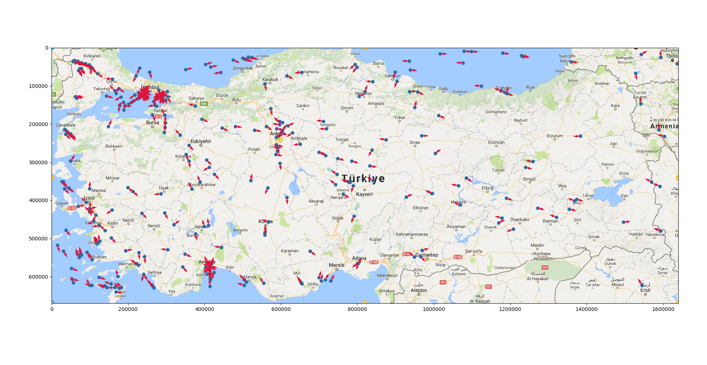
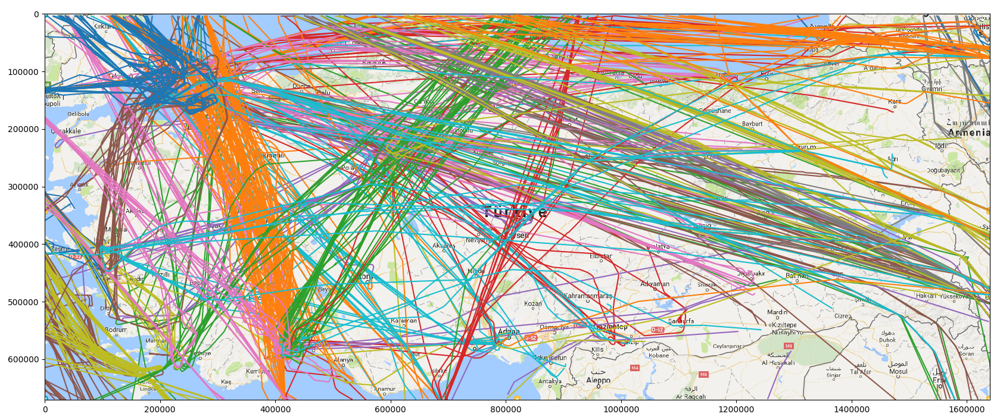
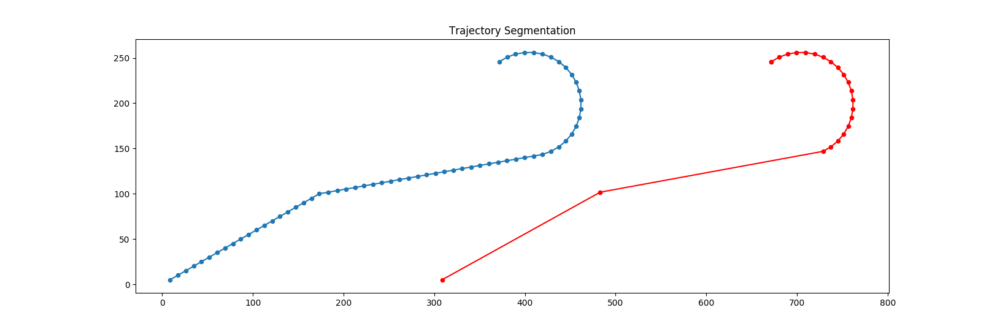
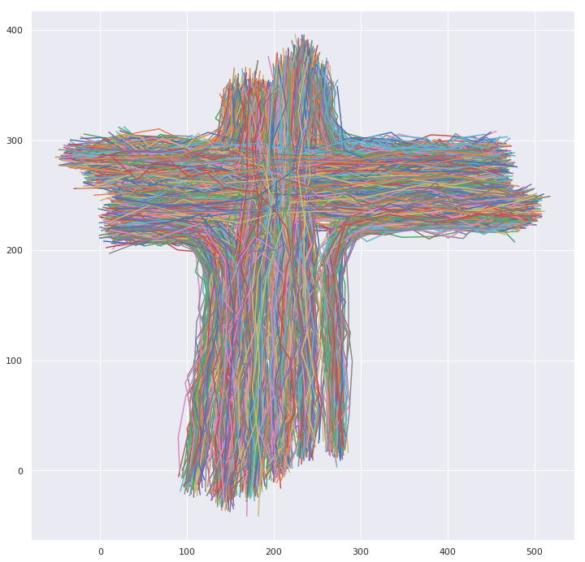
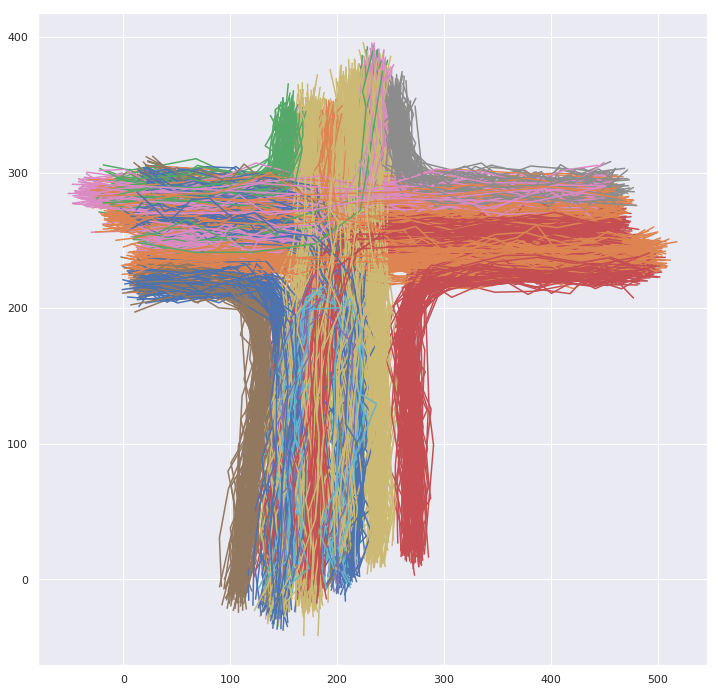

# comparing-trajectory-clustering-methods

This was my pattern recognition course term project. The goal is to compare 4 clustering algorithms (k-medoids, gaussian mixture model, dbscan and hdbscan) on civil flight data. More detail can be found in report.pdf file.

Resulting clusters look like this:

Trajectory segmentation is applied to reduce the number of sample points and hausdorff distance is used to compare the similarity between trajectories.

## Update (Feb 2019)

Added a [notebook](demo/demo.ipynb) demonstrating every step of the project. Please look at that first, it is more shorter and understandable than other parts of the project. It also shows these steps on a public dataset.

Public Dataset:

Clustered Trajectories:

